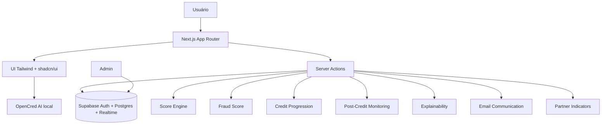

# OpenCred

OpenCred é uma plataforma de crédito progressivo para autônomos, com análise financeira autorizada, score alternativo, antifraude comportamental e explicabilidade para oferecer uma jornada de crédito mais transparente, adaptativa e segura.

## 1. Visão geral

O OpenCred organiza uma experiência completa de crédito para pessoas com renda real, mas histórico financeiro tradicional limitado. A plataforma combina dados financeiros autorizados, motores de decisão em TypeScript, Supabase e uma interface em Next.js para conduzir o usuário desde a criação do perfil até a evolução de confiança após o pagamento.

A proposta principal é permitir uma primeira concessão prudente e evolutiva: o usuário pode começar com limite conservador, concluir ciclos positivos e melhorar sua relação com a plataforma ao longo do tempo.

## 2. Problema

Autônomos, trabalhadores informais, motoristas, entregadores e freelancers frequentemente têm renda real, mas não conseguem comprová-la pelos modelos tradicionais. Essa renda pode variar por semana, mês, plataforma ou período de demanda.

Ao mesmo tempo, crédito rápido sem análise adequada aumenta risco de inadimplência, fraude e decisões pouco transparentes. O usuário também precisa entender por que recebeu aprovação, negativa, revisão adicional ou limite reduzido.

## 3. Solução proposta

O OpenCred propõe uma jornada com:

- Análise financeira autorizada.
- Score financeiro com dimensões interpretáveis.
- Crédito progressivo por ciclos de relacionamento.
- Fraud Score separado do Credit Score.
- Monitoramento inicial de risco após concessão.
- Explicabilidade jurídica e fatores compreensíveis.
- Comunicação oficial por email com registro auditável.
- Indicadores agregados de parceiros.
- Área do usuário para acompanhar conta, limite, histórico e empréstimo.
- OpenCred AI, assistente local com base controlada de orientação.

## 4. Público-alvo

- Autônomos.
- Motoristas e entregadores de aplicativo.
- Freelancers.
- Trabalhadores informais.
- Pessoas com renda real e histórico tradicional limitado.

## 5. Principais funcionalidades

- Autenticação por email/OTP com Supabase Auth.
- Área do usuário em `/minha-conta`.
- Conexão de conta financeira para enriquecer a análise autorizada.
- Solicitação de crédito.
- Consentimento para uso dos dados na análise.
- Etapa visual de análise em `/analise/[id]`.
- Resultado explicado com decisão, score, motivos e valor aprovado.
- Recebimento de crédito quando houver oferta aprovada.
- Empréstimo ativo em `/emprestimo/[id]`.
- Pagamento do empréstimo e fechamento do ciclo.
- Evolução de confiança e limite potencial.
- Nova solicitação após ciclo concluído, quando elegível.
- Painel admin com solicitações, score, fraude, parceiros, monitoramento e auditoria.
- OpenCred AI como assistente flutuante de orientação.

## 6. Fluxo geral do usuário

```text
login
→ minha conta
→ conexão financeira
→ solicitação de crédito
→ consentimento
→ análise visual
→ resultado
→ receber crédito
→ empréstimo ativo
→ pagamento
→ evolução de confiança
→ nova solicitação
```

## 7. Arquitetura

O projeto é um monolito Next.js com App Router. A interface usa Server Components e Client Components quando há interação local. Fluxos sensíveis, como análise, recebimento de crédito e pagamento, são executados por Server Actions autenticadas. O banco, autenticação e realtime ficam no Supabase.



Componentes principais:

- Frontend App Router em `app/`.
- Server Actions para fluxos de solicitação, análise, recebimento e pagamento.
- Supabase Auth, Postgres, RLS, Realtime e Edge Function de email.
- Módulos TypeScript puros para domínio.
- UI com Tailwind CSS, shadcn/ui, lucide-react e componentes locais.

## 8. Modelo de score

O Credit Score recebe transações financeiras e métricas derivadas em `lib/scoreEngine`. O resultado usa uma escala de 0 a 1000 e retorna score, breakdown por dimensão, decisão e limite sugerido.

Dimensões avaliadas:

- `regularity`: recorrência e previsibilidade das entradas.
- `capacity`: capacidade estimada frente ao valor solicitado.
- `stability`: estabilidade do fluxo financeiro.
- `behavior`: comportamento financeiro observado.
- `dataQuality`: qualidade e suficiência dos dados disponíveis.

Decisões possíveis:

- `approved`
- `approved_reduced`
- `further_review`
- `denied`

O score é complementado por crédito progressivo, Fraud Score, monitoramento inicial e indicadores agregados de parceiros antes da decisão final ser apresentada.

## 9. Crédito progressivo

O módulo `lib/creditProgression` aplica uma política de relacionamento por ciclos. A primeira concessão tende a ser mais conservadora, reduzindo exposição inicial e permitindo evolução conforme o usuário demonstra bom comportamento.

Níveis de confiança:

- `entry`
- `initial_confidence`
- `trusted`
- `premium`

Pagamentos em dia e ciclos concluídos podem fortalecer o histórico e aumentar o limite potencial em novas análises. Cada nova oferta continua sujeita à avaliação de risco.

## 10. Fraud Score e antifraude

O Fraud Score fica em `lib/fraudScore` e é separado do Credit Score. Ele avalia risco comportamental e operacional sem substituir a análise financeira.

Níveis de risco:

- `low`
- `moderate`
- `high`
- `critical`

Sinais considerados em alto nível:

- Indícios de renda sintética.
- Repetição incomum de padrões.
- Confiança de dispositivo e consistência operacional.

O Fraud Score pode reduzir uma aprovação, enviar a solicitação para revisão adicional ou bloquear uma concessão quando o risco exige cautela. O README não documenta thresholds internos ou critérios sensíveis de detecção.

## 11. Monitoramento inicial de risco

O módulo `lib/postCreditMonitoring` avalia o risco inicial após a concessão. Ele gera leitura operacional, alertas, recomendação de acompanhamento e sinalização de elegibilidade para ciclos futuros.

Essa etapa ajuda a conectar concessão, empréstimo ativo, pagamento e evolução de confiança sem transformar o monitoramento em cobrança.

## 12. Explicabilidade e comunicação

O módulo `lib/explainability` transforma a decisão em razões claras para o usuário e para a operação. A explicação cobre fatores principais, modo da decisão, necessidade de revisão e cuidados de segurança.

O módulo `lib/emailCommunication` gera comunicações estruturadas por categoria, como decisão, transparência, risco, segurança e operação. Os envios são roteados, renderizados em HTML/texto e registrados de forma auditável.

O OpenCred AI, em `lib/assistant` e `components/opencred-ai-widget.tsx`, orienta o usuário com uma base controlada de perguntas e respostas. Ele não chama IA externa; a experiência é local, previsível e segura.

## 13. Integração com parceiros

O módulo `lib/partnerIndicators` aplica indicadores agregados de parceiros para enriquecer crédito e fraude. Esses indicadores são complementares, não substituem os motores internos e não dependem de dados brutos expostos na interface.

Exemplos de uso:

- Reforço de regularidade de atividade.
- Leitura complementar de estabilidade.
- Ajustes moderados de risco quando sinais externos indicam cautela.

## 14. Admin

O painel admin permite acompanhar:

- Solicitações.
- Perfil do usuário.
- Decisão e status.
- Score financeiro.
- Fraud Score.
- Monitoramento inicial.
- Indicadores de parceiros.
- Consentimentos.
- Transações.
- Auditoria.
- Comunicações.
- Atualizações em tempo real via Supabase Realtime.

As rotas principais ficam em `/admin` e `/admin/solicitacoes/[id]`.

## 15. Tecnologias utilizadas

- Next.js 16 com App Router.
- React 19.
- TypeScript.
- Tailwind CSS 4.
- shadcn/ui e Base UI.
- Supabase Auth, Postgres, Realtime e Edge Functions.
- Zod para validação.
- Recharts para visualizações.
- Faker para dados de perfis e cenários.
- lucide-react para ícones.
- date-fns para datas.
- Sonner para feedback visual.
- oxlint e oxfmt para qualidade.
- TypeScript compiler para typecheck.

## 16. Estrutura de pastas

```text
app/                         Rotas App Router, layouts, pages e Server Actions
components/                  Componentes compartilhados e UI shadcn
hooks/                       Hooks React locais
lib/analysisPresentation/    Apresentação de análise e status
lib/analysisView/            Visões auxiliares da análise
lib/assistant/               Base local do OpenCred AI
lib/auth/                    Helpers de autenticação e perfil
lib/creditProgression/       Crédito progressivo
lib/emailCommunication/      Comunicação oficial por email
lib/explainability/          Explicabilidade da decisão
lib/fraudScore/              Fraud Score
lib/loans/                   Estado de empréstimo, pagamento e elegibilidade
lib/mockData/                Perfis e transações de apoio ao score
lib/partnerIndicators/       Indicadores agregados de parceiros
lib/postCreditMonitoring/    Monitoramento inicial pós-concessão
lib/scoreEngine/             Credit Score e dimensões
lib/storage/                 Helpers de storage
lib/supabase/                Clientes e tipos Supabase
supabase/                    Configuração, migrations, templates e Edge Functions
docs/                        Planejamento e documentação auxiliar
tests/                       Testes unitários
validation/                  Schemas Zod
```

## 17. Como rodar localmente

Pré-requisitos:

- Node.js `>=20.19.0`.
- npm.
- Projeto Supabase com as migrations aplicadas ou ambiente local Supabase.
- Supabase CLI, caso vá linkar projeto, aplicar migrations ou gerar tipos.

Passos:

```bash
npm install
```

Crie o arquivo de ambiente:

```bash
cp .env.example .env.local
```

No Windows PowerShell:

```powershell
Copy-Item .env.example .env.local
```

Preencha as variáveis Supabase em `.env.local`.

Se usar projeto remoto Supabase:

```bash
npx supabase link --project-ref <project-ref>
npx supabase db push
npm run db:types
```

Se usar banco local Supabase a partir das migrations:

```bash
npx supabase db reset
npm run db:types
```

Rode o servidor de desenvolvimento:

```bash
npm run dev
```

Acesse `http://localhost:3000`.

## 18. Scripts disponíveis

Scripts reais do `package.json`:

```bash
npm run dev        # inicia Next.js com Turbopack
npm run build      # build de produção
npm run start      # inicia build de produção
npm run typecheck  # tsc --noEmit
npm run lint       # oxlint
npm run format     # oxfmt
npm test           # testes unitários
npm run db:types   # gera tipos Supabase em lib/supabase/database.types.ts
```

## 19. Variáveis de ambiente

Variáveis presentes em `.env.example`:

```bash
NEXT_PUBLIC_SUPABASE_URL=
NEXT_PUBLIC_SUPABASE_ANON_KEY=
SUPABASE_SERVICE_ROLE_KEY=
EMAIL_OPERATIONS_INBOX=
```

Observações:

- `NEXT_PUBLIC_SUPABASE_URL` e `NEXT_PUBLIC_SUPABASE_ANON_KEY` são usadas no cliente.
- `SUPABASE_SERVICE_ROLE_KEY` deve ficar apenas no servidor/local seguro.
- `EMAIL_OPERATIONS_INBOX` é opcional e define a caixa de destino das comunicações internas.

Para envio real de email pela Edge Function `supabase/functions/send-email`, configure secrets SMTP no Supabase. Essas secrets não ficam em `.env.local`.

## 20. Testes e validação

O projeto possui testes unitários para CPF, score, crédito progressivo, Fraud Score, indicadores de parceiros, monitoramento, explicabilidade, comunicação por email e OpenCred AI.

Comandos recomendados:

```bash
npm run typecheck
npm run lint
npm test
```

Fluxo manual recomendado:

```text
login
→ cadastro
→ /minha-conta
→ conectar conta financeira
→ solicitar crédito
→ consentimento
→ /analise/[id]
→ resultado
→ receber crédito
→ /emprestimo/[id]
→ pagamento
→ voltar para /minha-conta
→ nova solicitação quando elegível
```

## 21. Decisões técnicas e trade-offs

- Monolito Next.js para acelerar entrega, reduzir coordenação entre serviços e manter a jornada coesa.
- Server Actions em vez de API routes para fluxos internos autenticados e próximos das páginas.
- Módulos TypeScript puros para regras de domínio, facilitando testes unitários e evolução isolada.
- Supabase para acelerar autenticação, banco, RLS, realtime e Edge Function de email.
- Indicadores agregados de parceiros em vez de dados brutos, reduzindo exposição e mantendo foco em sinais complementares.
- Comunicação de email estruturada e auditável para reforçar transparência e rastreabilidade.
- OpenCred AI com base local controlada, sem chamada externa, para manter consistência, segurança e previsibilidade.
